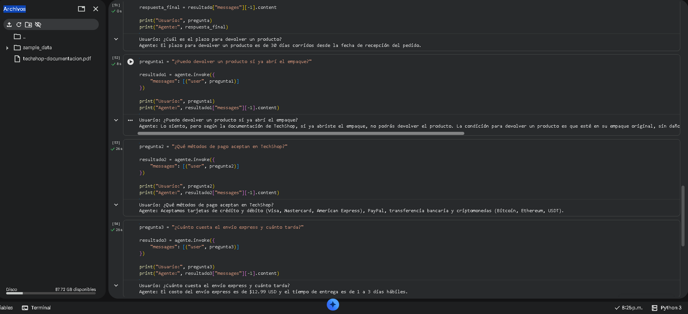

# 🤖 Alura Agente - TechShop

Proyecto final del programa **Oracle Next Education + Alura Latam**.

Este proyecto implementa un agente de inteligencia artificial capaz de responder preguntas en lenguaje natural utilizando como base la documentación de **TechShop**, una tienda en línea. El agente consulta un documento PDF y genera respuestas relevantes mediante un modelo de lenguaje.

---

## 🏗️ Arquitectura

El flujo de funcionamiento del proyecto es el siguiente:

PDF de documentación → PyPDF → LangChain/LangGraph → Modelo Llama 3.1 (Groq) → Respuesta al usuario

---

## 🛠️ Tecnologías utilizadas

- Python
- LangChain
- LangGraph
- Groq (modelo **llama-3.1-8b-instant**)
- PyPDF
- Google Colab (desarrollo)
- Oracle Cloud Infrastructure (OCI) (despliegue)

---

## ▶️ Cómo ejecutar el proyecto

1. Abrir el notebook `alura_agente_techshop.ipynb`.
2. Instalar las dependencias necesarias.
3. Ingresar una API Key válida de Groq cuando el notebook la solicite.
4. Ejecutar las celdas en orden.
5. Escribir una pregunta sobre la documentación de TechShop.

---

## ❓ Ejemplos de preguntas

**Pregunta:**
> ¿Qué métodos de pago aceptan?

**Respuesta:**
> Tarjetas de crédito, tarjetas de débito, PayPal y transferencia bancaria.

---

**Pregunta:**
> ¿Cuánto cuesta el envío express?

**Respuesta:**
> El envío express tiene un costo de USD 14.99.

---

**Pregunta:**
> ¿Puedo devolver un producto si ya abrí el empaque?

**Respuesta:**
> Sí, siempre que el producto esté en buen estado y se cumplan las políticas de devolución.

---

## ☁️ Despliegue en OCI

El proyecto fue ejecutado correctamente en **Oracle Cloud Infrastructure (OCI)** mediante una Notebook Session.

A continuación se muestra una captura del agente funcionando en OCI.

---

## 📸 Captura

---

## 👤 Autor

Renato Tamayac Galvez - Oracle Next Education
[Mi GitHub](https://github.com/andorrante)
